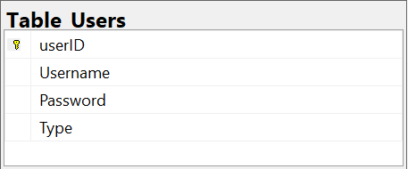
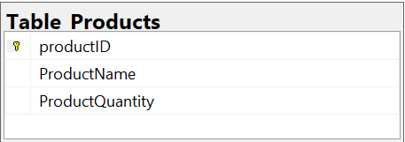

# SQLServer_MagazinFructe
I created a database in SQL Server for the fruit store.

# Table_Users
The primary key is userID and the administrator has type 1.

# Table_Products
The primary key is productID.

